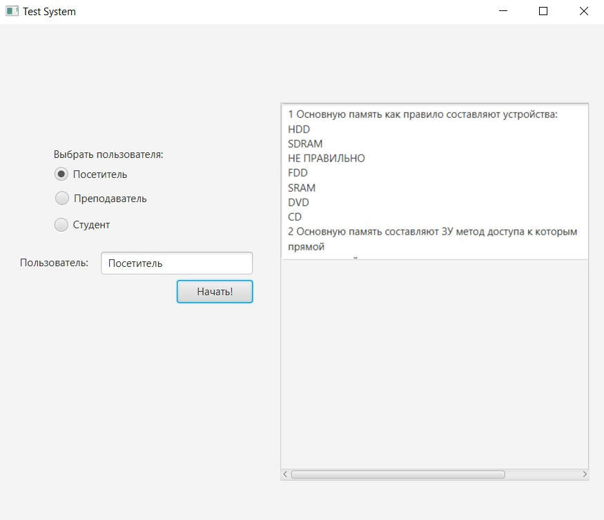
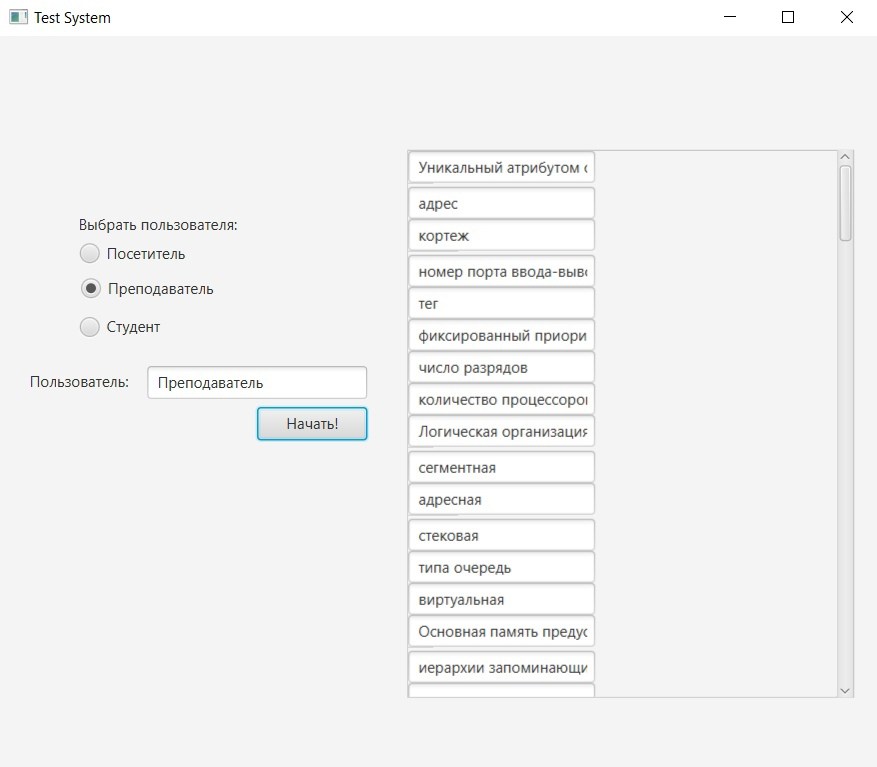
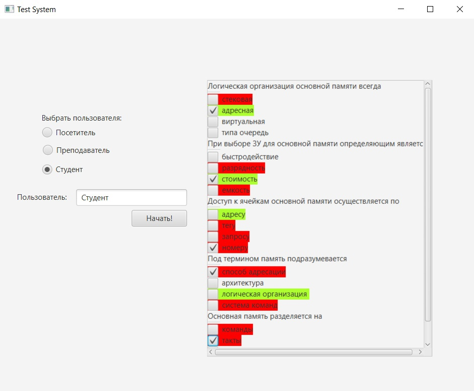

# Task 11. Посредник (Mediator)
Режим тестирования, если пользователь Студент, то программа предполагает вывод вопроса и 1 правильного и 3 неправильных ответов. Режим редактирования, если пользователь Преподаватель, то программа предполагает вывод полей редактирования с вопросом и всеми правильными, а потом всеми неправильными ответами. Режим чтения, если пользователь Посетитель, то программа предполагает вывод только для чтения. Для организации взаимодействия был использован паттерн Mediator. Посредник в зависимости от введенного логина запускает соответствующий режим

## Интерфейс программы
## Пользователь посетитель

## Пользователь преподаватель

## Пользователь студент

